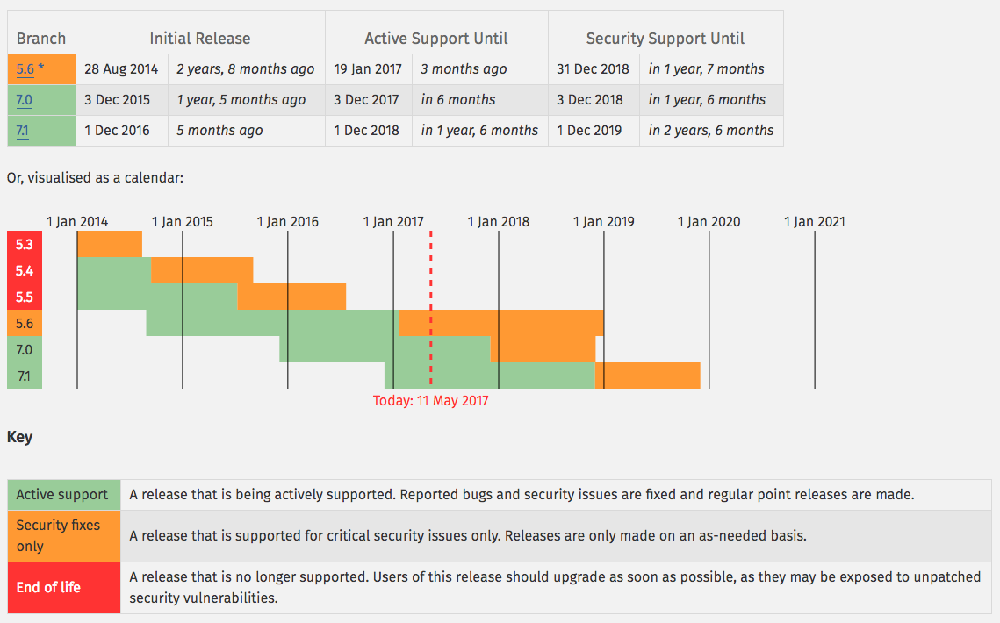
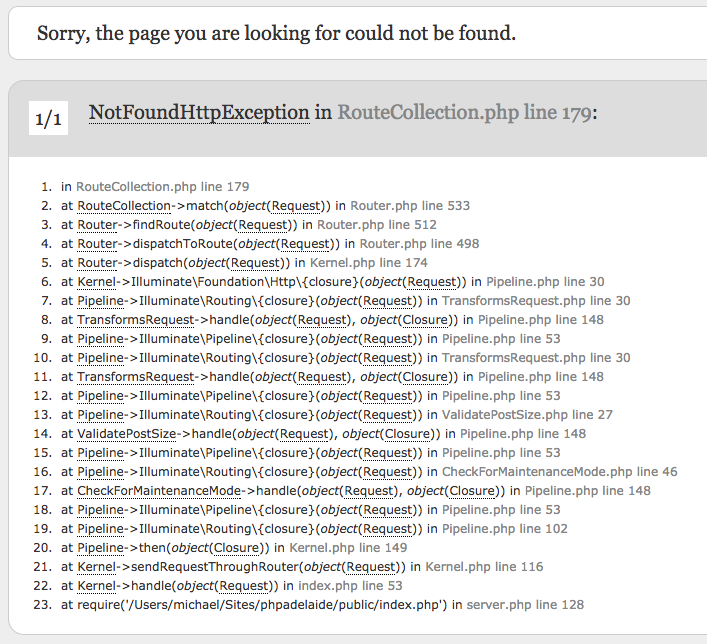
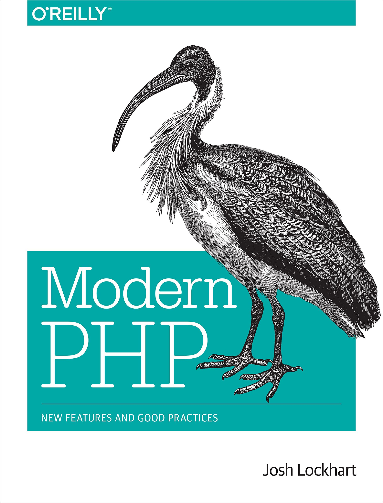
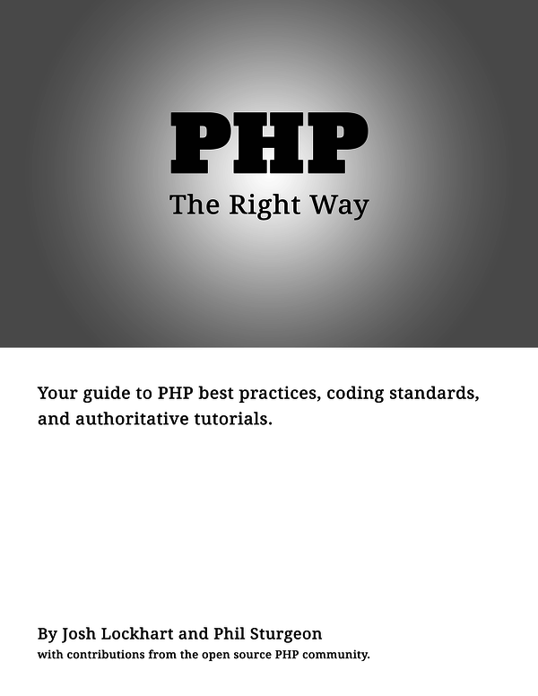

build-lists: true

# PHP in 2017

---

# Keep up to date

* PHP development moves much quicker than it used to

^ 5.0 came out in Jul 04, 5.1 Nov 05, 5.2 Nov 06, 5.3 Jun 09, 5.4 Mar 12, 5.5 Jun 13, 5.6 Aug 14, 7 Dec 15, 7.1 Dec 16

* HHVM kicked PHP development into gear
* Largely rewritten engine == much faster
* PHP 5.6 won't receive updates beyond 2018

^ PHP 5.6 is the final PHP 5 release. There will be no new feature development for PHP 5 past this. LTS operating system maintainers will (generally) backport security fixes for their supported versions for many years, which is why a lot of systems still run very old versions of PHP.

---

# Keep up to date - release cycles

The PHP Group implemented a release timeline for new versions in 2011

* at least one (patch) release every month
* a minor release should occur once a year
* every minor release is actively supported for at least 2 years
* active support followed by 1 year of security/bug fixes

^ Three years for each minor release. No new features during a minor release cycle.

---
# Supported PHP versions



^ Breaking changes between 5.3 and 5.5 were a lot more impactful as the language went through a big period of change.
5.5 > 7.0 had minimal breaking changes as the language matured a lot

---

# PHP Framework Interoperability Group (FIG)

* Formed by members of major frameworks in 2009
* Discuss commonality between projects to work together
* Main audience is each other, but many in the wider community adopt decisions
* Discuss, vote, and implement PHP Standard Recommendations (PSRs)

---

# PHP Standard Recommendations (PSRs)

Most well-known recommendations

* PSR-0 - Original autoloading standard
* PSR-1 - Basic coding standard
* PSR-2 - Coding style guard
* PSR-4 - Autoloading standard

^ It's important to note that these are **recommendations** and that you're not forced to use them, however, if you move between projects and frameworks, or release open source code, adhering to them makes you and your potential contributors lives easier.

---

# Autoloading standards - PSR-0

PSR-0 class naming and autoloading came from Horde/PEAR conventions before PHP supported namespaces (PHP < 5.3).

^ In this convention, it was common to place all vendor code in a single main directory.

    /path/to/src
        Dyrynda/
            ServiceA/
                ClassA.php # Dyrynda_ServiceA_ClassA
        Skinner/
            ServiceB/
                ClassB.php # Skinner_ServiceB_ClassB

---

# Autoloading standards - PSR-4

PSR-4 meant packages were no longer in a single, global location

^ PSR4 - heralded the arrival of Composer
Each package is within its own separate directory, under a vendor namespace

    vendor/
        dyrynda/
            package_a/
                src/
                    ClassA.php # Dyrynda\PackageA\ClassA
                tests/
            package_b/
                src/
                    ClassB.php # Dyrynda\PackageB\ClassB

---

# PSR-0 and PSR-4 - autoloading standards

Each package must have at least a top-level vendor namespace and a package-level namespace

    Dyrynda\PhpAdelaide\ModernPhp
       |         |         |
    Vendor    Package    Class

---

# PSR-1 and PSR-2 - coding (style) standards

Cover many things about what code looks like

* Which `<?php ?>` tags should be used
* Whether or not we should be using ~~tabs~~ or **spaces**


* You don't **have** to follow these **but** it helps

^ PSRs are all about increasing interoperability. Your editor or IDE of choice can most definitely be configured to handle code style and formatting for you. You focus on code, your editor will make sure your files are indented with spaces. Tools like the PHP Coding Standards fixer as part of your workflow will further help you.
There are currently 8 accepted, 1 in review, 8 accepted, and 1 deprecated PSRs
Learn more at www.php-fig.org

---

# PHP the language

Flexible, dynamic, and lets developers writing PHP how they want to.

^ It has evolved dramatically

* Object-oriented programming in PHP 5 (2004)
* Anonymous  functions, namespaces in PHP 5.3 (2009)
* Traits in PHP 5.4 (2012)

---

# Paradigms

* Object-oriented programming
* Functional programming
* Meta programming

^ *OOP*: A rich objected-oriented feature set including support for classes, interfaces, inheritance, exceptions, and more
*Functional programming*: first class, meaning functions can be assigned to variables, passes as arguments to other functions and returned by functions. Recursion is supported, although most PHP is focused on iteration. Anonymous functions have been around since PHP 5.3
*Meta programming*: PHP supports this through mechanisms like reflection and magic methods (`__get`, `__set`, `__clone`, `__toString`, `__invoke`)

---

# Object-oriented programming

```php
class Profile
{
    private $name;
    private $twitter;

    public function __construct($name, $twitter)
    {
        $this->name = $name;
        $this->twitter = $twitter;
    }

    public function getName()
    {
        return $this->name;
    }

    public function getTwitter()
    {
        return $this->twitter;
    }
}
```

---

# Functional programming

```php
array_map(function ($n) {
    return $n * 2;
}, [1, 2, 3]);

// [2, 4, 6]

array_filter(['Michael', '', 'Dyrynda'], function ($string) {
    return trim($string) !== '';
});

// ['Michael', 'Dyrynda']
```

---

# Meta programming

```php
class Profile
{
    private $attributes;

    public function __get($key)
    {
        return array_key_exists($key, $this->attributes) ? $this->attributes[$key] : null;
    }

    public function __set($key, $value)
    {
        $this->attributes[$key] = $value;
    }

    public function __toString()
    {
        return "{$this->name} - {$this->twitter}";
    }
}

$profile = new Profile;
$profile->name = 'Michael Dyrynda';
$profile->twitter = '@michaeldyrynda';
print $profile->name; // Michael Dyrynda
print $profile->twitter; // @michaeldyrynda
print $profile->instagram; // null
print $profile; // Michael Dyrynda - @michaeldyrynda
```

---

# Namespaces

* Allows the same class to exist multiple times in a project
* Available since PHP 5.3
* The backbone of the PSR-4 autoloading standard

---

# Standard PHP Library (SPL)

* Native classes and interfaces for you to use and extend
* Predefined constants, common data structures, and iterators for traversing them
* Interfaces (for iterators) and Exceptions
* File handling

---

# Dependency management

* The main charter of the FIG is on interoperability of code
* Code is distributed via packages, primarily on Packagist
* Packages are installed using Composer
 * No more copy/paste from phpclasses.org
* Composer is specifically for managing dependencies and configuring autoloading

---

# Installing packages

```bash
    composer require psr/log
```

* Adds the dependency to your `composer.json` file, as well as an entry to your `composer.lock` file.
  * `composer.json` describes your project dependencies
  * `composer.lock` is for installing your dependencies
* Downloads and installs the package to `vendor/psr/log`
* Automatically sets up autoloading in `vendor/autoload.php`

^ The lock file provides deterministic resolution of dependencies and ensures that every time you - or anybody else - runs `composer install` in your project repo they will be guaranteed the exact same set of dependencies. Composer warrants a talk all of its own. Hint hint.

---

# Coding practices

* PHP is a vast language for developers of many experience levels
* Easy to get started, flexible enough to be used at large scale

---

# Coding practices - date and time

* Dates and times are hard
* `DateTime` and `DateTimeImmutable` classes make life easier
* `DateTimeZone`, `DateInterval`, and `DatePeriod` complement them
* `Carbon` makes life even easier, with terse method names

---

# Coding practices - date and time

```php
// DateTime
$date = new DateTime('now', new DateTimeZone('Australia/Adelaide'));
$date->add(new DateInterval('P1D')); // Add one day
print $date->format('Y-m-d H:i:s'); // $date is now +1 day from now

// DateTime method for brevity
print (new DateTime('now', new DateTimeZone('Australia/Adelaide')))
    ->add(new DateInterval('P1D'))
    ->format('Y-m-d H:i:s');

// Using Carbon - more readable
print Carbon::now('Australia/Adelaide')->addDay()->format('Y-m-d H:i:s');
```

^ Yes, you can omit the parameters to `DateTime` if you just want the current time and your timezone is already set.

---

# (Common) design patterns

* Factories
* Singletons
* Strategy
* Front controller
* Model-View-Controller (MVC)

^ *This first, then dotpoints*: If you're using a framework, a lot of the high-level design of your application will be driven by conventions used by that framework. Again, to aid in interoperability of other developers in this instance. **Does anybody know what any of these are?**
* *Factories*, using a named constructor to create an object you want to use (rather than new Class($param1, $param2))
* *Singletons*, ensure that you get the exact same instance of a class every time you ask for it for an entire request lifecyle. Helpful for loggers, session stores, etc.
* *Strategy*, useful for encapsulating common families of functionality separating knowledge of implementation from the caller. Simple example is to define an output interface which specifies how data should be loaded. You could have a strategy that serializes the data, one that renders JSON, one that returns an array.
* *Front controller*, where you have a single entrance point to your web app that handles all requests. In Laravel, there is an `index.php` that is responsible for dispatching all routes requested from the app
* *MVC*, lets you break up your models (data access), views, and controllers, which handle the request, process data returned by models, and load views to send in a response.

---

# Dependency injection

> Dependency injection is a software design pattern that allows the removal of hard-coded dependencies and makes it possible to change them, whether at run-time or compile-time.
> -- Wikipedia

^ This isn't as complicated as it sounds. Dependency injection is a fancy way of saying that class dependencies are injected into the class constructor, rather than being instantiated inside of the class. **Who has used Laravel?** Laravel is built *entirely* around dependency injection.

---

# Without dependency injection

```php, [.highlight:5-8]
class UserController
{
    private $repo;

    public function __construct()
    {
        $this->repo = new UserRepository;
    }
}
```

---

# With dependency injection

```php, [.highlight:5-8]
class UserController
{
    private $repo;

    public function __construct(UserRepository $repo)
    {
        $this->repo = $repo;
    }
}
```

^ It's a subtle difference, but with dependency injection you invert control of how the user repository is injected into your class. This serves to decouple your controllers, for example, from knowing what their dependencies are. It is also powerful, because you can bind complex things to your dependency injection container and the container will now how to resolve them when asked. UserRepository could talk to a remote API with some client SDK that needs to be passed an API key at run time.

---

# Databases

* 🚨 ~~`mysql`~~
* `mysqli` - MySQL-improved, simple transition from `mysql`
  * Swapped args from (`$query`, `$link`) to (`$link`, `$query`)
* `PDO` - common interface for different persistence layers
 * ⚠️ Does not translate your queries
* Framework abstractions - Doctrine, ActiveRecord, etc.

^ *mysql* was deprecated in 5.5 and removed in 7.0
If you're still on PHP5 and haven't upgraded from mysql, do it sooner rather than later. It'll ease your transition to PHP7.

---

# Templating

* PHP *is* a templating language
* Templates are a convenient way of separating controller, domain, and presentation logic (MVC)
* Clear separation between presentation and the rest of your app
* Improve organisation of presentation code, often in a `views/` folder

---

# Templating - plain PHP

* Natural choice for many, given they are *just* PHP
* Easy to intermingle PHP code - just not domain logic 🙏
* No new syntax to learn
* Beware of escaping issues - never trust your user input

```php
    <?= $user['bio'] ?> /* javascript:alert('Hello, world!'); */
```

---

# Templating - compiled

* PHP's improved as a language, not so much for templating
* Compiled options like Twig and Smarty fill the void
* Offer new syntax specific to templating
 * Automatic escaping, inheritance, simplified control structures, etc.
* Designed to be easier to write, cleaner to read, safer to use
* Many frameworks have their own flavour (Aura.View, Blade)

---

# Errors

* PHP is typically exception-light
* Many errors will emit, but not stop code flow unless fatal
* PHP has several levels of error severity - errors, notices, warnings, etc.
* `E_STRICT` and `E_DEPRECATED` were introduced to suggest changes in code to ensure better forward-compatibility

---

# Changing error behaviour

* You can override which errors PHP displays - useful in production, as long as you log them somewhere

```php
    error_reporting(E_ERROR | E_WARNING);
```

* You can even suppress errors inline

```php
    print @$foo['bar'];
```

* PHP's error control operator will *completely* swallow this error.

^ It isn't logged, it isn't displayed, it's gone.

---

# Changing error behaviour


🚨 If you can avoid using the suppression operator, you should consider it.

```php
// Avoid
print @$foo['bar'];

// PHP < 7.0
print isset($foo['bar']) ? $foo['bar'] : '';

// PHP >= 7.0
print $foo['bar'] ?? '';
```

---

# Changing error behaviour

It is default practice in Symfony and Laravel to translate *any* PHP errors into `ErrorException`s

^ In development mode, this results in a helpful stacktrace, which also helps you fix issues, preventing them from reaching your production environment



---

# Exceptions

* Common in most popular programming languages
* Often overlooked in PHP
* Error makes it impossible for anybody to handle them
* Exceptions ought to be thrown to make developers aware of an error

^ Exceptions are typically caught during development. They're not meant for your users, but you can catch exceptions and act on them in a user-friendly way.

---

# SPL Exceptions

* You can create dedicated exception classes of your own, extending the base `Exception` class
* PHP has many specific exception classes
 * `InvalidArgumentException`
 * `LogicException`
 * `RuntimeException`
 * http://php.net/spl.exceptions for a comprehensive list

---

# Passwords

* Don't roll your own password security
* **Don't roll your own password security**
* Don't use `md5`, `sha1` - these are reproducible and susceptible to collision
* Passwords are automatically salted since PHP 7.0, adding a random string to each password before hashing, using built-in functions

---

# Passwords

Hashing functions have been available since 5.5

^ Makes salting, hashing, and safety of passwords - and application data - easy, using the strongest algorithm supported by PHP; BCrypt.

```php
$hash = password_hash('secret', PASSWORD_DEFAULT);

if (password_verify('forgetful', $hash)) {
    // Login ok
} else {
    // Forgetful user. Or hacker!
}
```

^ PASSWORD_DEFAULT currently uses BCrypt, but will change in time as new and stronger algorithms are available. It's recommended you use this for forward-compatibility, but you must specify the value (no default).

---

# Passwords - rehashing

A mechanism exists to determine if a hashed value needs rehashing.

^ This is useful when the time comes to upgrade algorithm, or when hashing options change

```php, [.highlight:2-5]
if (password_verify('secret', $hash)) {
    if (password_needs_rehash($hash, PASSWORD_DEFAULT, $options)) {
        // If so, create new hash and replace old one
        $newHash = password_hash($password, PASSWORD_DEFAULT, $options);
    }

    // Login
}
```

---

# Filtering

* Never trust foreign content. **Ever**.
* `$_GET`, `$_POST`, `$_SERVER` can be user-manipulated
* Files, session, cookies, etc. are all foreign content
* `filter_var` and `filter_input` can be used for filtering
* You should filter all input, and sanitise (escape) on output
* Frameworks will usually handle this for you 😅

---





^ Thanks to Josh Lockhart, who authored the book and Phil Sturgeon who subsequently helped to get phptherightway.com up and running. Both are an in-depth and comprehensive look at Modern PHP development.

---

# Thank you

* Michael Dyrynda - @michaeldyrynda
* North Meets South Web Podcast - @northsouthaudio
* Laravel News Podcast - @laravelnews
